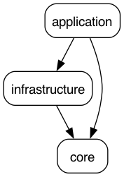

# Hexagonal Template Java

This is a multi-module Java 21 Spring Boot project following a pragmatic Hexagonal Architecture.

## Modules

- `core/`
- `infrastructure/` 
- `application/` 




## Tech Stack

- Java 21
- Spring Boot 3.4.4
- JUnit 5 + Mockito
- Maven (Multi-module)
- Swagger / OpenAPI
- Docker + Docker Compose


## Running using Docker Compose

```bash
docker-compose up --build
```

## OpenAPI
- Swagger: http://localhost:8080/swagger-ui.html
- API Endpoint: `GET /api/welcome/message`


## Suggested Package Structure
This project follows Hexagonal Architecture (aka Ports and Adapters) — but with flexibility in mind. While the core module is intended to stay free of Spring and technical dependencies, you may relax that rule when needed.
Below are suggested package layouts for each module:

### core/ — Domain-Centric Layer (Pure Java preferred)

```text
com.template.core
├── model           # Core domain models (pure Java)
├── dto             # Data transfer objects (used between layers)
├── service         # Interfaces for business logic (use cases)
├── exception       # Domain-specific exceptions
```
You may place simple logic inside DTOs or enrich models with business behavior, keeping the layer portable and testable.

### application/ — Spring Boot App (Primary Adapter)
```text
com.template.application
├── controller      # REST controllers (driving adapter)
├── service         # Service implementations (calls ports from core)
├── config          # Spring config (beans, Swagger, CORS, etc.)
├── dto             # API-facing DTOs (may map to/from core DTOs)
├── exception
│   ├── exception     # `@ControllerAdvice` for global exception handling
```
This module wires the app together, exposing functionality to the outside world via REST, GraphQL, etc.

### infrastructure/ — Secondary Adapters (DB, Messaging, etc.)
```text
com.template.infrastructure
├── db
│   ├── entity         # JPA entities (usually map to domain models)
│   ├── repository     # Spring Data interfaces or custom DAOs
│   └── mapper         # MapStruct or manual mappers
├── messaging
│   ├── consumer       # Kafka, RabbitMQ, etc. listeners
│   └── producer       # Message publisher logic
```
This module can be split into submodules like infrastructure-db, infrastructure-messaging, etc., if you want to separate concerns more strictly.